# Control de Acceso a la Aplicación  
***********************************

## Acceso a la aplicación

Esta sección permite llevar un control de acceso en la aplicación, además de visualizar y gestionar la información de las cuentas de usuarios. Se compone de una tabla de registros que muestra los siguientes datos: usuarios, nombre de usuarios, direcciones IP, estatus (usuario conectado o desconectado) e información sobre la última conexión.  

La gestión de acceso a la aplicación para las cuentas de usuarios que se pueden ejecutar en esta sección incluye las siguientes acciones:

-   **Enviar mensaje** (enviar correo electrónico).
-   **Configurar cuenta de usuario** (bloquear y desbloquear cuenta de usuario).   
-   **Enviar notificación**. 
-   **Ver información del usuario**. 
-   **Asignar permisos de acceso**. 
-   **Desbloquear cuenta de usuario**.

Para llevar a cabo la gestión de acceso a la aplicación se deben seguir los siguientes pasos:

***Usuario Administrador***   

-   Acceder al sistema e iniciar sesión con usuario y contraseña.
-   Ingresar a través del panel lateral a **Panel de Control** y dirigirse a la sección **Acceso a la Aplicación**.

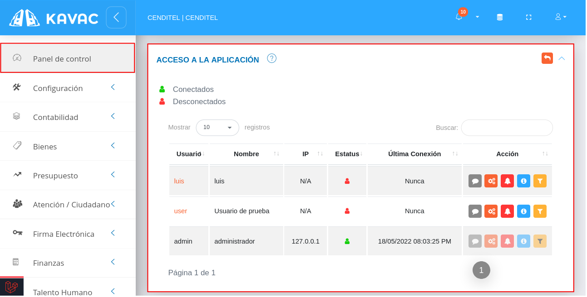
Figura 130: Acceso a la Aplicación

Haciendo uso de los elementos que se ubican sobre la columna titulada **Acción**, se ejecutan las funciones que se describen a continuación.

!!! info ""
    **Enviar mensaje** 

    -   Presione el botón **Enviar mensaje**  para enviar un correo electrónico al usuario seleccionado.

    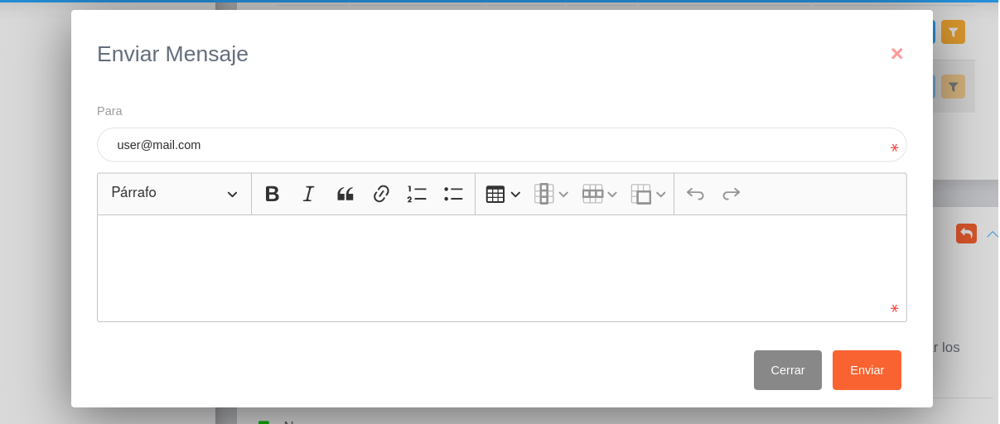  

!!! info ""
    **Configurar cuenta de usuario** 

    -   Presione el botón **Configurar cuenta de usuario**  para establecer las siguientes configuraciones:
        -   **Bloquear cuenta de usuario**
        -   **Desactivar cuenta de usuario** 
        
    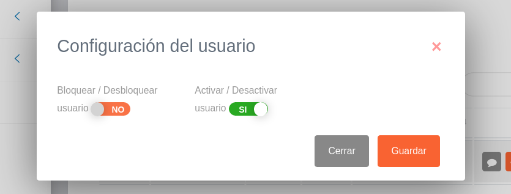

!!! info ""
    **Enviar notificación** 

    -   Presione el botón **Enviar notificación**  para enviar un mensaje al usuario a través del sistema. El usuario receptor recibirá este mensaje en su bandeja de notificaciones.

    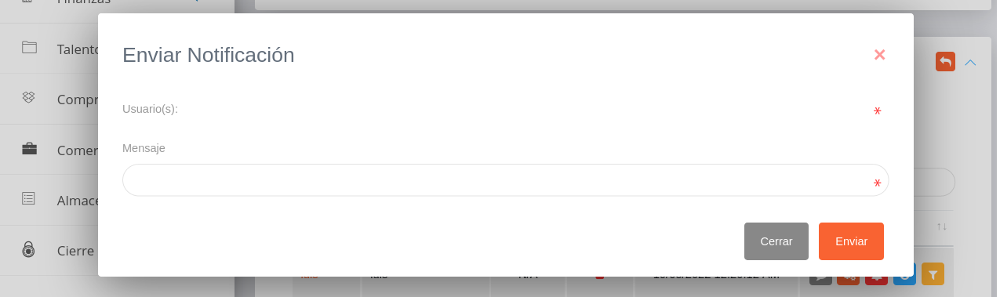

!!! info ""
    **Ver información del usuario**  

    -   Presione el botón **Ver información del usuario**  para ver detalles de la cuenta de usuario. 

    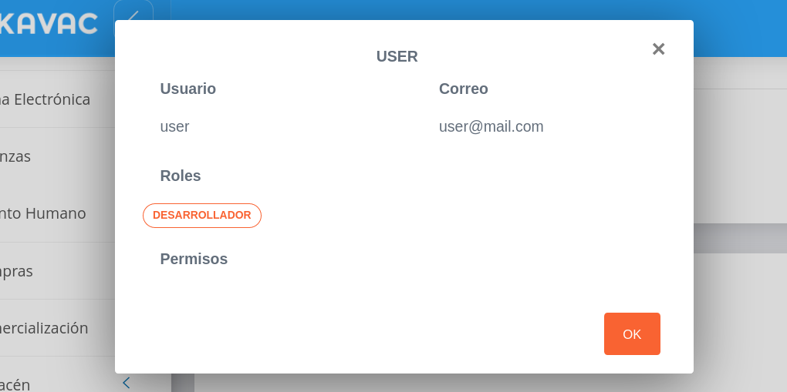

!!! info ""
    **Asignar permisos de acceso**      

    -   Presione el botón **Asignar permisos de acceso**  para configurar los permisos establecidos para la cuenta de usuario en gestión. 

    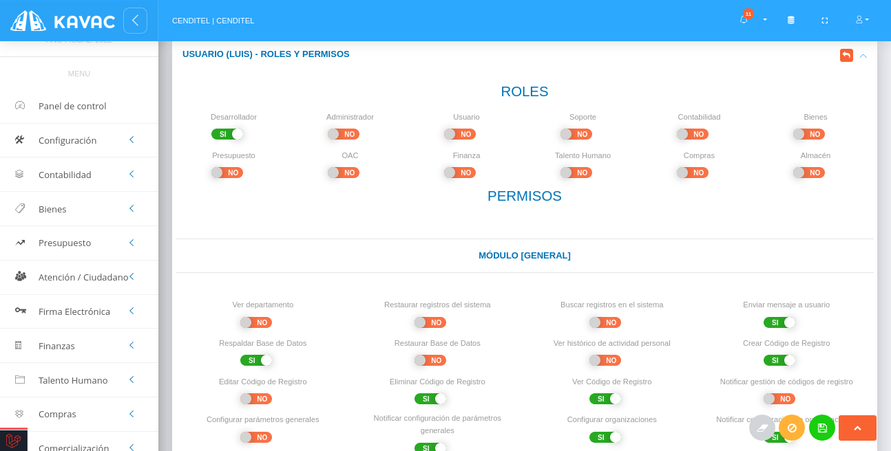

    - Indique la opción  del botón de selección del permiso que desee habilitar.
    - Presione el botón **Guardar**   para registrar los cambios efectuados.
    - Presione el botón **Cancelar**   para cancelar registro y regresar a la ruta anterior.
    - Presione el botón **Borrar**  para eliminar datos del formulario.
    - Para retornar a la ruta anterior presione el botón .
 
!!! info ""
    **Desbloquear cuenta de usuario**
    
    -   Presione el botón **Desbloquear** 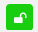 para desbloquear una cuenta de usuario seleccionada. 

    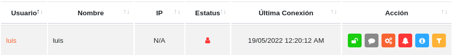

    **Nota**: Si un usuario ha superado el limite de intentos fallidos al iniciar sesión, su cuenta de usuario es bloqueada. El usuario administrador debe hacer uso de esta funcionalidad para desbloquear la cuenta de usuario.

## Auditoría de registros 

Esta sección es una herramienta que permite visualizar e inspeccionar los registros realizados desde una cuenta de usuario.   

Para realizar una auditoría o seguimiento de un registro, es necesario seguir los siguientes pasos: 

***Usuario Administrador***

-   Acceder al sistema e iniciar sesión con usuario y contraseña.
-   Ingresar a través del panel lateral a **Panel de Control** y dirigirse a la sección **Auditoría de Registros**.

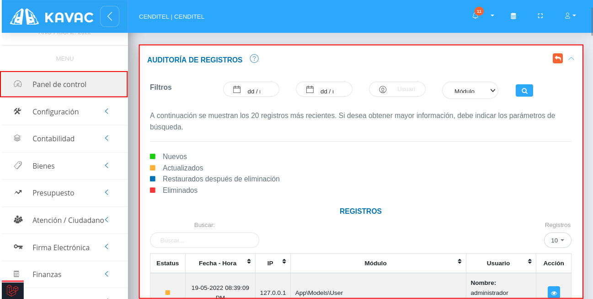
Figura 131: Auditoría de Registros

!!! note ""
    **Filtrar registros**

    La tabla de registros posee un historial de 20 registros más recientes. Si se desea obtener mayor información, es necesario indicar los parámetros de búsqueda. 

    -   Para filtrar los registros se requiere completar los campos correspondientes a los siguientes parámetros: 

        -   **Fecha de inicio**(fecha a partir de la cual se realiza la búsqueda). 
        -   **Fecha de fin**(fecha específica hasta la que se realiza la búsqueda). 
        -   **Usuario**.
        -   **Módulo**.  
    
    -   Presione el botón **Filtrar**  para ejecutar la búsqueda de registros.

    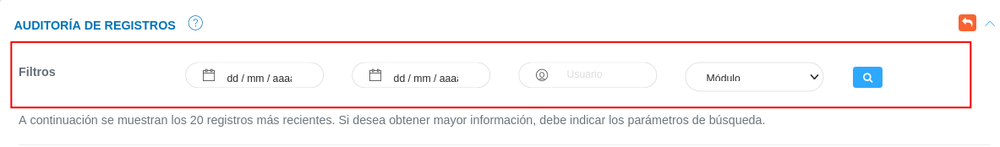

-   Seleccione un registro y presione el botón **Ver detalles del registro**  ubicada en la columna titula **Acción** de la tabla de registros.

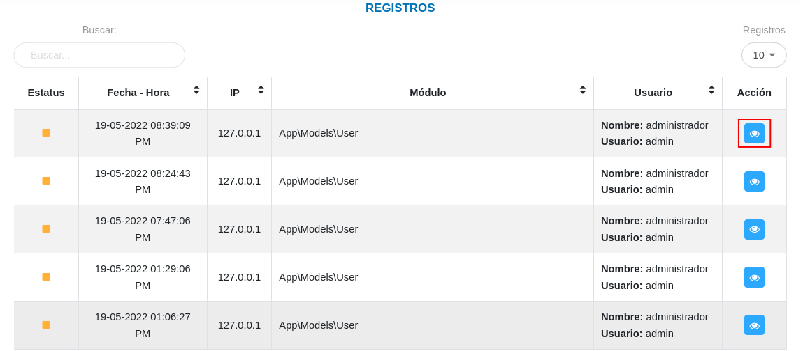
Figura 132: Auditoría de Registros

-   A continuación el sistema despliega una sección donde se describen los datos del registro seleccionado. 

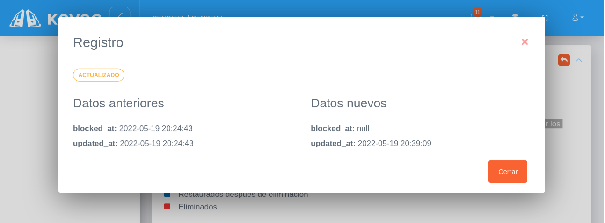
Figura 133: Auditoría de Registros

## Restaurar registros eliminados 

Esta sección permite restaurar los registros que han sido eliminados, la sección presenta un historial de registros eliminados con información detallada del registro de forma tabulada.  

Para restaurar un registro, es necesario seguir los siguientes pasos: 

***Usuario Administrador***

-   Acceder al sistema e iniciar sesión con usuario y contraseña.
-   Ingresar a través del panel lateral a **Panel de Control** y dirigirse a la sección **Restaurar Registros Eliminados**.

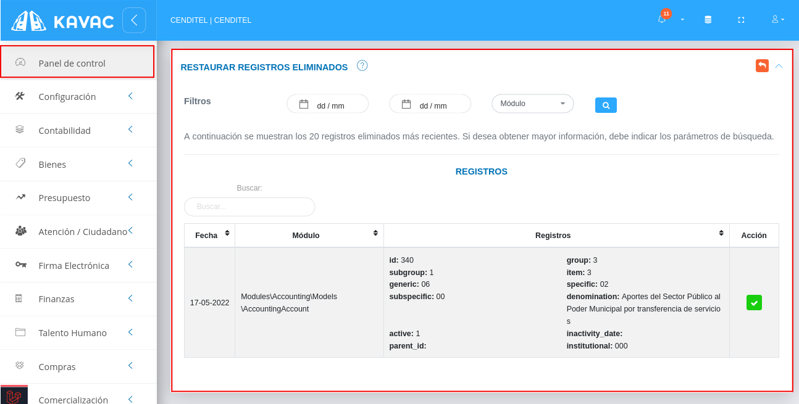
Figura 134: Auditoría de Registros

!!! note ""
    **Filtrar registros**

    La tabla de registros posee un historial de 20 registros más recientes. Si se desea obtener mayor información, es necesario indicar los parámetros de búsqueda. 

    -   Para filtrar los registros se requiere completar los campos correspondientes a los siguientes parámetros: 

        -   **Fecha de inicio**(fecha a partir de la cual se realiza la búsqueda). 
        -   **Fecha de fin**(fecha específica hasta la que se realiza la búsqueda). 
        -   **Usuario**.
        -   **Módulo**.  
    
    -   Presione el botón **Filtrar**  para ejecutar la búsqueda de registros.

    

-   Seleccione un registro y presione el botón **Restaurar registro**  ubicada en la columna titula **Acción** de la tabla de registros.

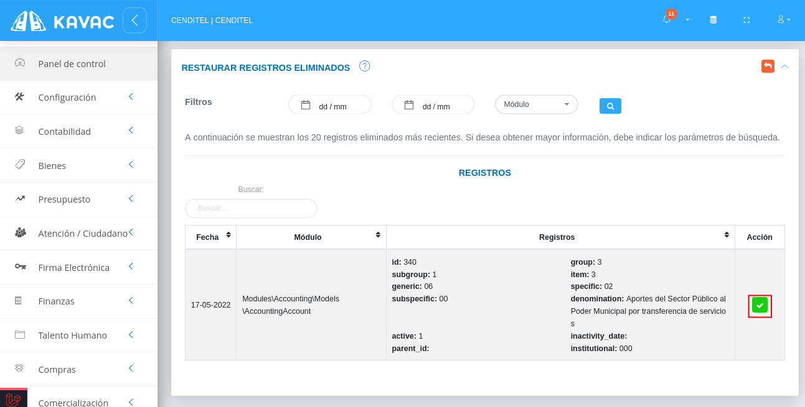
Figura 135: Auditoría de Registros

-   **Confirme** la acción a ejecutar a través de la ventana emergente que se muestra a continuación. 

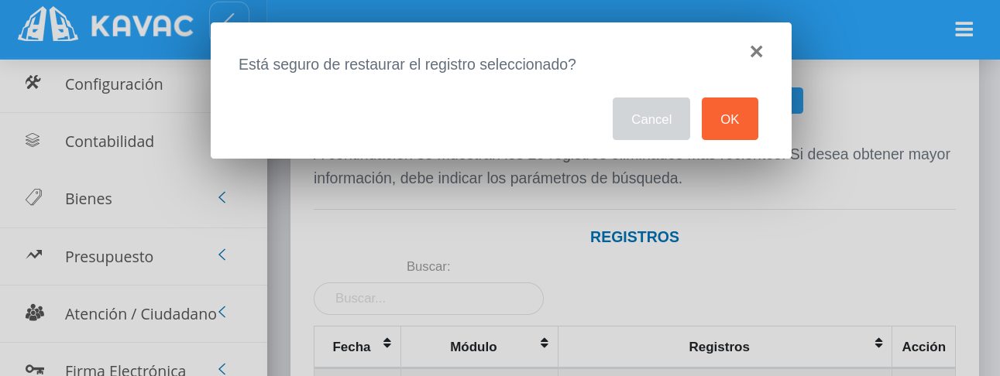
Figura 136: Auditoría de Registros

