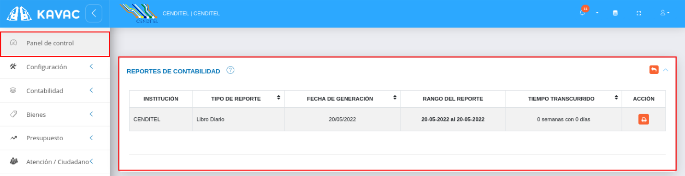

# Panel de Control Módulo de Contabilidad
*****************************************

## Operaciones en módulo de contabilidad

A través del **Panel de Control** es posible realizar un seguimiento de los asientos contables registrados en el sistema a partir de la sección de **Operaciones en el Módulo de Contabilidad**.   En esta sección se muestra en forma tabulada registros de los asientos contables e información relacionada a cada uno de ellos que describen los siguientes datos: fecha de registro, referencia, concepto referente a la operación, total relacionado con la partida doble (debe y haber del asiento) y el estado  del asiento contable. De igual forma, desde esta sección es posible generar una copia de cada asiento contable generado a partir del módulo de contabilidad. 

Para acceder a la sección de operaciones en el módulo de contabilidad del panel control se deben seguir los siguientes pasos:

***Usuario Administrador***

-   Acceder al sistema e iniciar sesión con usuario y contraseña.
-   Ingresar a través del panel lateral a **Panel de Control** y dirigirse a la sección **Operaciones en el Módulo de Contabilidad**.

Figura 137: Operaciones el en Módulo de Contabilidad

**Imprimir registro**

-   Seleccione un asiento contable y presione el botón **Imprimir registro**  ubicado en la columna titulada **Acción** de la tabla de registros.  

Figura 138: Imprimir Asiento Contable

-   A continuación el sistema genera un archivo en formato **pdf** con detalles sobre el asiento contable.

Figura 139: Reporte

## Reportes de contabilidad

El **Panel de Control** permite visualizar los diferentes reportes generados a partir del módulo de contabilidad.    En la sección de **Reportes de Contabilidad** se muestra de forma tabulada los reportes generados e información relacionada a cada uno de ellos que describen los siguientes datos: tipo de reporte, fecha de generación, rango de reporte y tiempo transcurrido. 

Para acceder a la sección de operaciones en módulo de contabilidad del panel control se deben seguir los siguientes pasos:

***Usuario Administrador***

-   Acceder al sistema e iniciar sesión con usuario y contraseña.
-   Ingresar a través del panel lateral a **Panel de Control** y dirigirse a la sección **Operaciones en Módulo de Contabilidad**.

Figura 140: Reportes de Contabilidad

**Imprimir registro**

-   Seleccione un asiento contable y presione el botón **Imprimir registro**  ubicado en la columna titulada **Acción** de la tabla de registros.  

Figura 141: Imprimir Reporte

-   A continuación el sistema genera un archivo en formato **pdf** con detalles sobre el asiento contable.

Figura 142: Reporte

