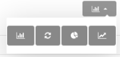

# Panel de Control Módulo de Bienes 
**********************************

## Gráficos del inventario de bienes 

El **Panel de Control** presenta una sección relacionada con los bienes institucionales.  La sección de **Gráficos del Inventario de Bienes Institucionales**, representa la cantidad de recursos en función de los bienes institucionales. Es posible seleccionar los datos que el sistema representará gráficamente, ya sean bienes existentes, más solicitados o menos solicitados, haciendo uso de los botones de selección. 

Para acceder a la sección de gráficos del inventario de bienes del panel control se deben seguir los siguientes pasos:

***Usuario Administrador***

-   Acceder al sistema e iniciar sesión con usuario y contraseña.
-   Ingresar a través del panel lateral a **Panel de Control** y dirigirse a la sección **Gráficos del Inventario de Bienes**.

Figura 143: Gráficos del Inventario de Bienes

-   Indique la opción  del botón de selección para filtrar los registros de bienes por las siguientes categorías: **Existencia**, **Más Solicitados** o **Menos Solicitados**. 

Figura 144: Gráficos del Inventario de Bienes

!!! success ""
    **Cambiar el tipo de gráfico**

    

    Seleccione un modo de visualización de gráfico según su tipo. 

    - Gráfico de barras: 
    - Gráfico de dona: 
    - Gráfico de tortas: 
    - Gráfico de líneas: 

    

## Historial de operaciones módulo de bienes

La sección **Historial de Operaciones Módulo de Bienes** es una funcionalidad que permite al administrador del sistema realizar un seguimiento de los registros realizados en el módulo de bienes, incluye una tabla de registros que describen la fecha de operación y descripción del registro. De igual forma, es posible consultar información sobre el registro y generar un archivo en formato pdf con detalles sobre el registro.    

Para acceder a la sección de historial de operaciones módulo de bienes del panel control se deben seguir los siguientes pasos:

***Usuario Administrador***

-   Acceder al sistema e iniciar sesión con usuario y contraseña.
-   Ingresar a través del panel lateral a **Panel de Control** y dirigirse a la sección **Historial de Operaciones Módulo de Bienes**.

Figura 145: Historial de Operaciones en el Módulo de Bienes

-   Presione el botón **Consultar registro**  ubicado en la columna titulada **Acción** de un registro que se desee consultar. 

Figura 146: Historial de Operaciones en el Módulo de Bienes

-   A continuación el sistema despliega una sección donde se describen los datos del registro seleccionado.

Figura 147: Historial de Operaciones en el Módulo de Bienes

-   Presione el botón **Imprimir registro**  ubicado en la columna titulada **Acción** de un registro seleccionado. 

Figura 148: Historial de Operaciones en el Módulo de Bienes

