# Herramientas para Desarrolladores
**********************************

Esta sección se encuentra dirigida a usuarios desarrolladores o usuarios avanzados que requieren la construcción de nuevas funcionalidades de la aplicación. A través de esta sección se administran las herramientas de la interfaz gráfica como los iconos, componentes, botones y formularios disponibles para incorporar en el sistema.  Asimismo, se muestra una opción de ajustes para configurar el estado del sistema ya sea en modo mantenimiento, demostración o depuración y la gestión de eventos emitidos por el sistemas. 

## Acceder a herramientas para desarrolladores 

***Usuario Desarrollador***

-   Acceder al sistema e iniciar sesión con usuario y contraseña.
-   Ingresar a través del panel lateral a **Panel de Control** y ubicarse en la sección **Herramientas para Desarrolladores** (ver Figura).

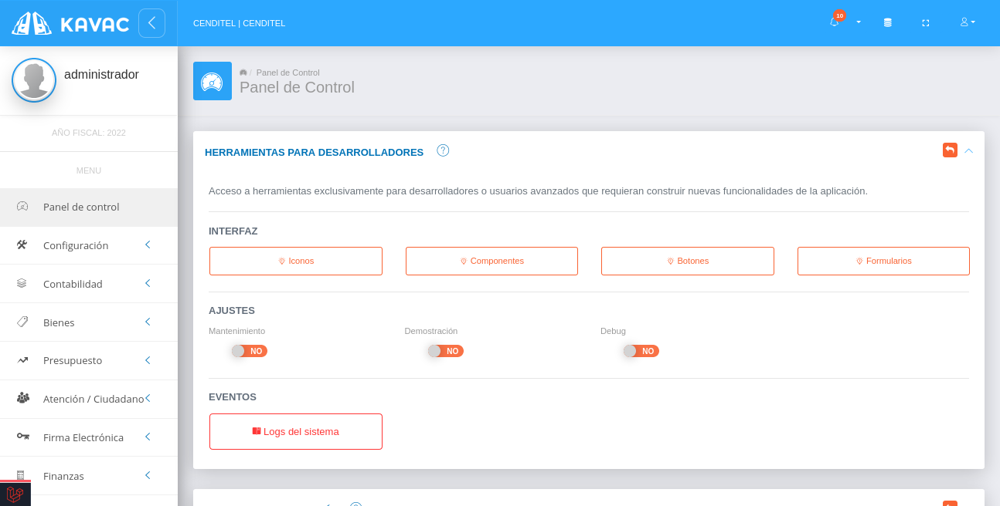
Figura 124: Herramientas para Desarrolladores

### Elementos de Interfaz

Estos elementos de interfaz mantienen una uniformidad en el desarrollo de la aplicación, el desarrollador puede apropiarse de ellos y usarlos de manera fácil y rápida en la creación o modificación de alguna funcionalidad del sistema. 

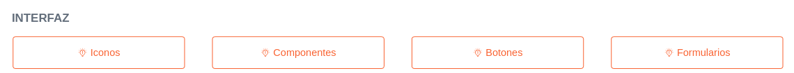
Figura 125: Interfaz

#### Iconos

-   Presione el botón **Iconos** de las herramientas de interfaz para acceder a la lista.

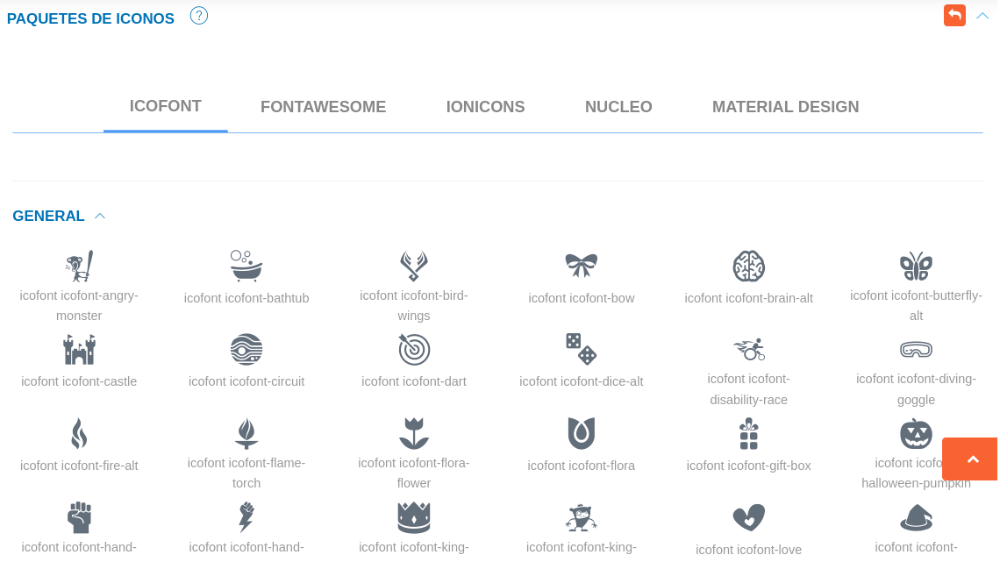
Iconos

#### Componentes

-   Presione el botón **Componentes** para acceder a la lista. 

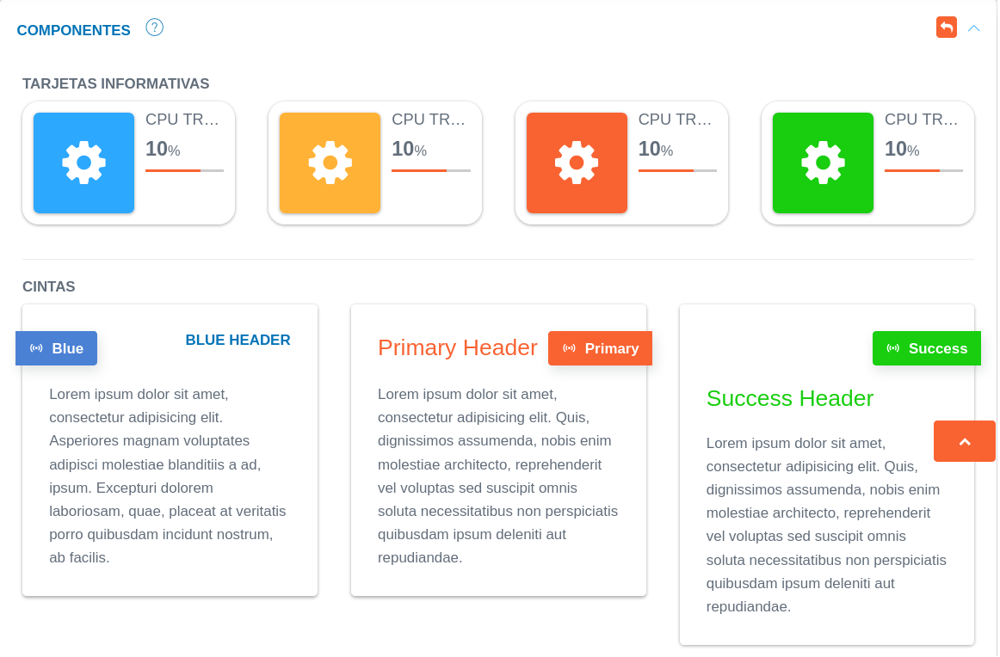
Componentes

#### Botones

-   Presione el botón **Botones** para acceder a la lista. 

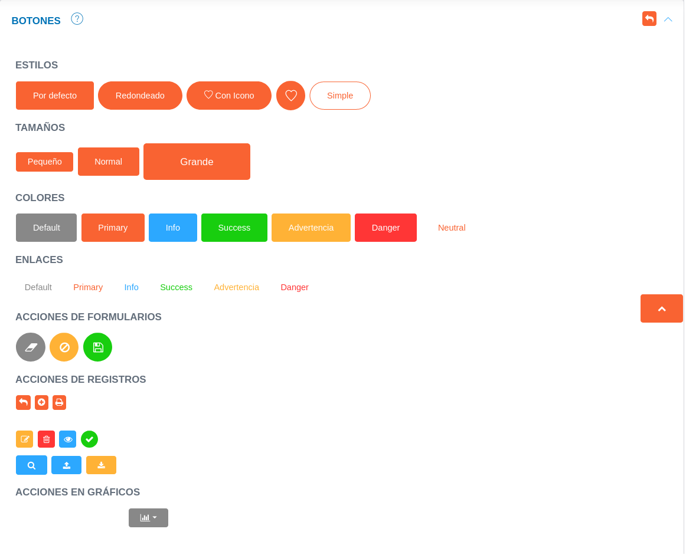
Botones

#### Formularios

-   Presione el botón **Formularios** para acceder a la lista. 

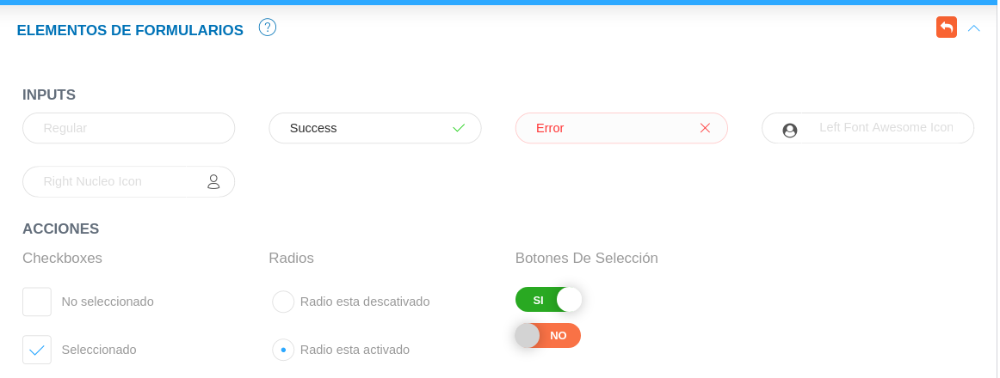
Formularios

### Ajustes

Los ajustes del panel de control permiten al desarrollador o usuarios con permisos sobre el módulo, establecer un estado o modo para el sistema.  Estos son activados o desactivados a través de los botones de selección, se hace uso de ellos cuando se requiere realizar algún cambio que podría afectar otras áreas del sistema, evaluar el correcto funcionamiento antes de un entorno de producción o consultar sobre los logs de la aplicación.         

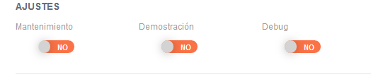
Figura 126: Ajustes

#### Modo mantenimiento

Una vez que se active el modo mantenimiento la aplicación se encontrará **inactiva**, cuando los usuarios ingresen se mostrará una vista predeterminada, el sistema arroja una excepción (HttpException) con un código de estado 503.  

La vista predeterminada puede ser personalizada, para indicar al usuario que la aplicación se encuentra en mantenimiento; modificando el archivo **503.blade.php** ubicado en **resources/views/errors**.

Esta herramienta es usada cuando surge la necesidad de realizar grandes cambios que podrían afectar el correcto funcionamiento de las actividades que estén realizando los usuarios en el sistema.  

Es importante considerar que cuando el sistema está en modo mantenimiento las colas de trabajo no se ejecutan, estas se reactivan una vez la aplicación ha salido del modo mantenimiento. 

#### Modo demostración

El modo demostración puede ser activado una vez la aplicación sea implementada en un servidor, con el objetivo de que sirva como demostración de los procesos que ejecuta el sistema y no tenga incidencia sobre una base de datos en entorno de producción. 

#### Modo debug 

Los **Logs** del sistema se almacenan en la carpeta **storage/logs** , sin embargo; al activar el modo **debug** el sistema muestra información sobre los eventos y errores del sistema en la pantalla.  Esta herramienta agrega una barra de información en la parte inferior del navegador, donde cada tipo de log se muestra en una pestaña.
Permite consultas a la base de datos, ver tiempos de ejecución,  vista de excepciones entre otras cosas.

### Eventos del sistema 

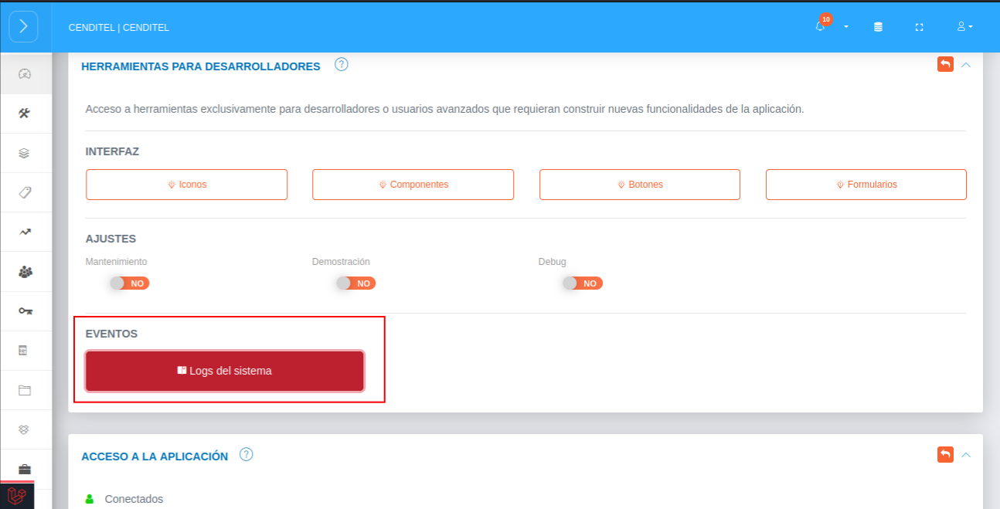
Figura 127: Logs del sistema

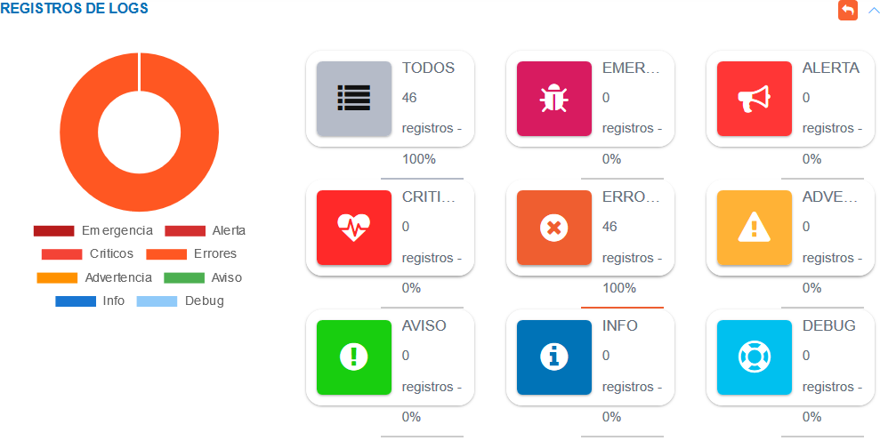
Figura 128: Logs del sistema

Los **Logs** de **Laravel** permiten tener un registro de incidencias en el sistema, este registro almacena información sobre todos los errores y eventos inesperados lo que permite depurar más fácil el código de la aplicación.   Los **Logs** se registran en el archivo **laravel.log** en la carpeta **/storage/logs**.

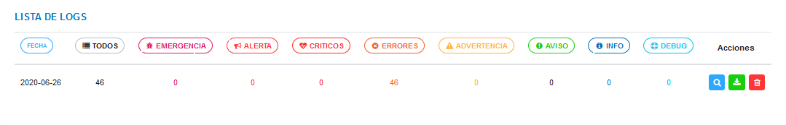
Figura 129: Lista de Logs

!!! note "Ver incidencia" 
    -   Presione el botón **Ver incidencia** para ver detalles del registro.

    

    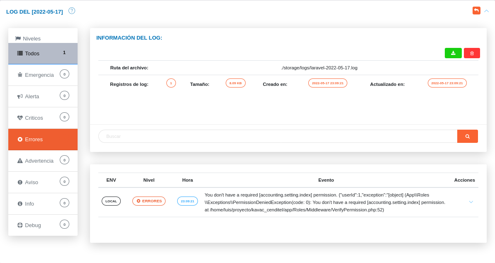

!!! success "Descargar incidencia" 
    -   Presione el botón **Descargar incidencia** para descargar un archivo que incluye información sobre la incidencia.

    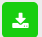

!!! danger "Eliminar incidencia" 
    -   Presione el botón **Eliminar incidencia** para eliminar registro.

    