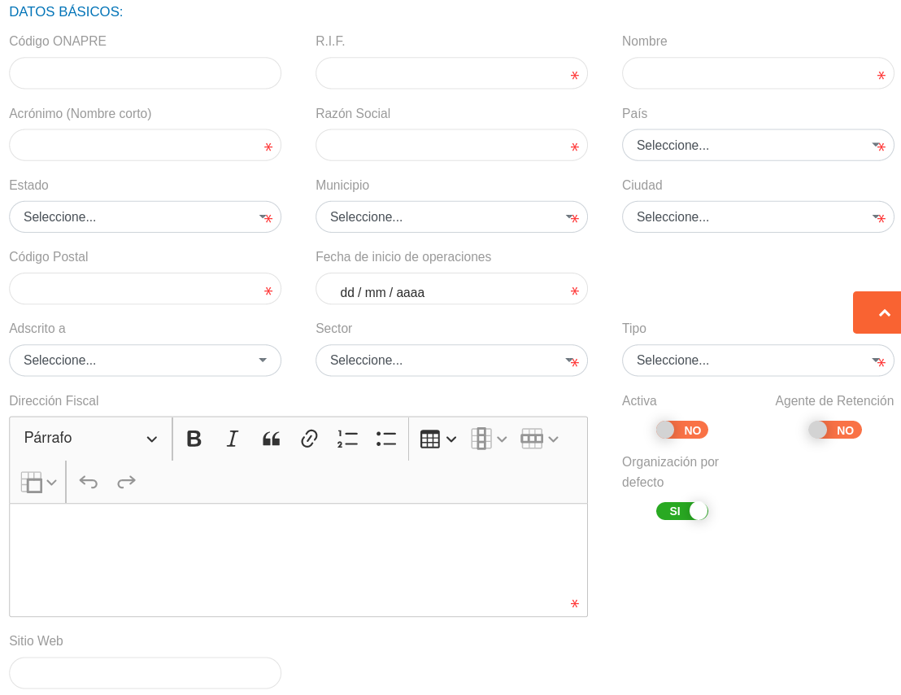
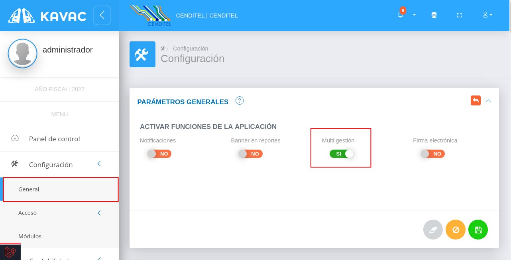
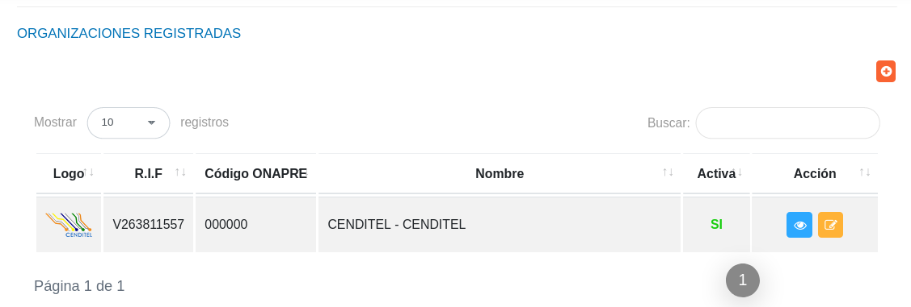
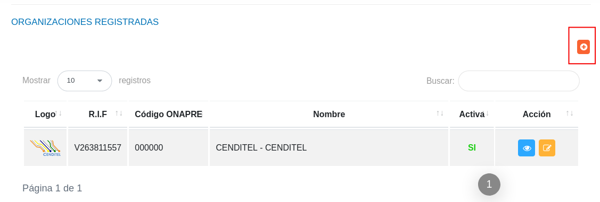
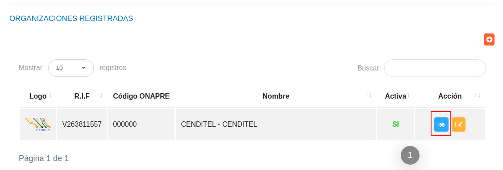

# Configuración de una Organización   
***********************************

Configurar una organización usuaria es el primer requerimiento a completar por el usuario con el rol de administrador para comenzar la gestión sobre el sistema KAVAC.  A continuación se describen los pasos a seguir para el registro y gestión de una o varias organizaciones.

## Registrar organización 

Para iniciar el registro de una organización se deben seguir los siguientes pasos: 

***Usuario Administrador***

-   Acceder al sistema e iniciar sesión con usuario y contraseña.
-   Ingresar a través del panel lateral a **Configuración** > **General** y ubicarse en la sección **Configurar Organización** (ver Figura).

Figura 36: Configurar Organización

### Logotipo y banner institucional

-   Para establecer un logotipo y banner institucional haga clic sobre los recuadros correspondientes que tienen por titulo **IMAGEN** (ver Figura).
-   Seleccione un archivo desde su directorio local (ver Figura ).  

Figura 37: Seleccionar Logotipo y Banner Institucional desde Directorio Local
 

Figura 38: Logotipo y Banner Institucional

### Datos básicos

-   Complete el formulario del apartado **Datos Básicos**. Tenga en consideración completar los campos obligatorios que son requeridos para el registro de una institución.

!!! note "Nota"
    Los campos de selección del apartado **Datos básicos** incluyen información configurada previamente a través de los registros comunes del sistema. Si se requiere incluir información diferente a la que se encuentra por defecto se recomienda agregar estos registros en la configuración de registros comunes. 

    Para agregar registros comunes acceda a **Configuración** > **General** > **Registros Comunes**. 

    

    -   ***País***: Para crear un nuevo registro de país acceda a **Configuración** > **General** > **Registros Comunes** > **Países**. 
    -   ***Estado***: Para crear un nuevo registro de estado acceda a **Configuración** > **General** > **Registros Comunes** > **Estados**. 
    -   ***Municipio***: Para crear un nuevo registro de municipio acceda a **Configuración** > **General** > **Registros Comunes** > **Municipios**. 
    -   ***Ciudad***: Para crear un nuevo registro de ciudad acceda a **Configuración** > **General** > **Registros Comunes** > **Ciudades**.
    -   ***Adscrito a***: Para crear un nuevo registro de dependencia acceda a **Configuración** > **General** > **Registros Comunes** > **Unidades/ Dependencias**. 
    -   ***Sector***: Para crear un nuevo registro de sector económico acceda a **Configuración** > **General** > **Registros Comunes** > **Sectores Económicos**.
    -   ***Tipo***: Para crear un nuevo registro de tipo de organización acceda a **Configuración** > **General** > **Registros Comunes** > **Tipos de organizaciones**.
     

Figura 39: Datos Básicos de la Organización

### Datos complementarios

-   Complete el formulario del apartado **Datos Complementarios**. Tenga en cuenta que todos los campos de este apartado no son obligatorios, por lo que no se requiere agregar información de forma obligatorio para completar el registro de una organización.

Figura 40: Datos Complementarios de la Organización

- Presione el botón **Guardar**   para registrar los cambios efectuados.
- Presione el botón **Cancelar**   para cancelar registro y regresar a la ruta anterior.
- Presione el botón **Borrar**  para eliminar datos del formulario.
- Si desea recibir ayuda guiada presione el botón .
- Para retornar a la ruta anterior presione el botón .

## Editar organización 

!!! note "Nota"
    Los pasos que se describen a continuación para la actualización de datos de una organización son válidos solo cuando existe el registro de una sola organización y la opción **multi gestión** del sistema se encuentra desactivada. 

    Para más información consule el apartado [Multi gestion](#multi-gestion) de este manual.

Para actualizar los datos de una organización registrada se requiere seguir lo siguientes pasos:

-   Ingresar a través del panel lateral a **Configuración** > **General** y ubicarse en la sección **Configurar Organización** (ver Figura).

Figura 41: Editar Organización

-   Actualice los datos del formulario siguiendo los pasos descritos en el apartado [Registrar organizacion](#logotipo-y-banner-institucional).
-   Presione el botón **Guardar**   para registrar los cambios efectuados.

## Multi gestión

El sistema KAVAC incorpora la gestión de multiples organizaciones desde una misma instancia.  Esta funcionalidad permite la integración entre organizaciones, abriendo paso a la gestión y control sobre recursos organizacionales y automatizando las transacciones entre dos o más organizaciones. 

Esta funcionalidad se encuentra desactivada por defecto, para activar dicha funcionalidad se requiere seguir los siguientes pasos: 

-   Ingresar a través del panel lateral a **Configuración** > **General** y ubicarse en la sección **Parámetros Generales** (ver Figura).

Figura 42: Habilitar Opción Multi-Gestión

-   Indique la opción  del botón de selección del campo **Multi gestión** para habilitar la gestión de multiples organizaciones. 
- Presione el botón **Guardar**   para registrar los cambios efectuados.
- Presione el botón **Cancelar**   para cancelar registro y regresar a la ruta anterior.
- Presione el botón **Borrar**  para eliminar datos del formulario.
- Si desea recibir ayuda guiada presione el botón .
- Para retornar a la ruta anterior presione el botón .

## Gestionar organizaciones

La gestión de organizaciones se lleva a cabo a través del apartado **Organizaciones Registradas**, este apartado se encuentra disponible si la opción [Multi gestión](#multi-gestion) se encuentra activa.  

-   Para acceder a esta sección debe dirigirse a **Configuración** > **General** y ubicarse en la sección **Registrar Organización** apartado **Organizaciones Registradas** (ver Figura).

A través del apartado **Organizaciones Registradas** se listan los registros de **Organizaciones** en una tabla que incluye los siguientes datos: **Logo**, **R.I.F**, **Código ONAPRE**, **Nombre** y **Estatus**.   

Desde este apartado se pueden llevar a cabo las siguientes acciones: 

-   ***Registrar organización***.   
-   ***Consular registros***.
-   ***Editar registros***. 

Figura 43: Organizaciones Registradas

### Registrar organización

-   Presione el botón **Crear registro**  ubicado en la parte superior derecha del apartado **Organizaciones Registradas** (ver Figura )

Figura 44: Registrar Organización / Multi-Gestión Activa

-   A continuación complete el formulario siguiendo los pasos descritos en el apartado [Registrar organizacion](#logotipo-y-banner-institucional).
-   Presione el botón **Guardar**   para registrar los cambios efectuados.

### Consular registros

-   Presione el botón **Consultar registro**  ubicado en la columna titulada **Acción** de un registro de organización que se prefiere consultar. 

Figura 45: Consular Registros de Organizaciones / Multi-Gestión Activa

-   A continuación el sistema despliega una sección donde se describen los datos de la organización seleccionada. 

Figura 46: Datos de la Organización

### Editar registros

-   Presione el botón **Editar registro**   ubicado en la columna titulada **Acción** del registro de organización que se desee seleccionar para actualizar datos. 

Figura 47 : Editar Registros de Organizaciones/ Multi-Gestión Activa

-   Actualice los datos del formulario siguiendo los pasos descritos en el apartado [Registrar organizacion](#logotipo-y-banner-institucional).
-   Presione el botón **Guardar**   para registrar los cambios efectuados.

