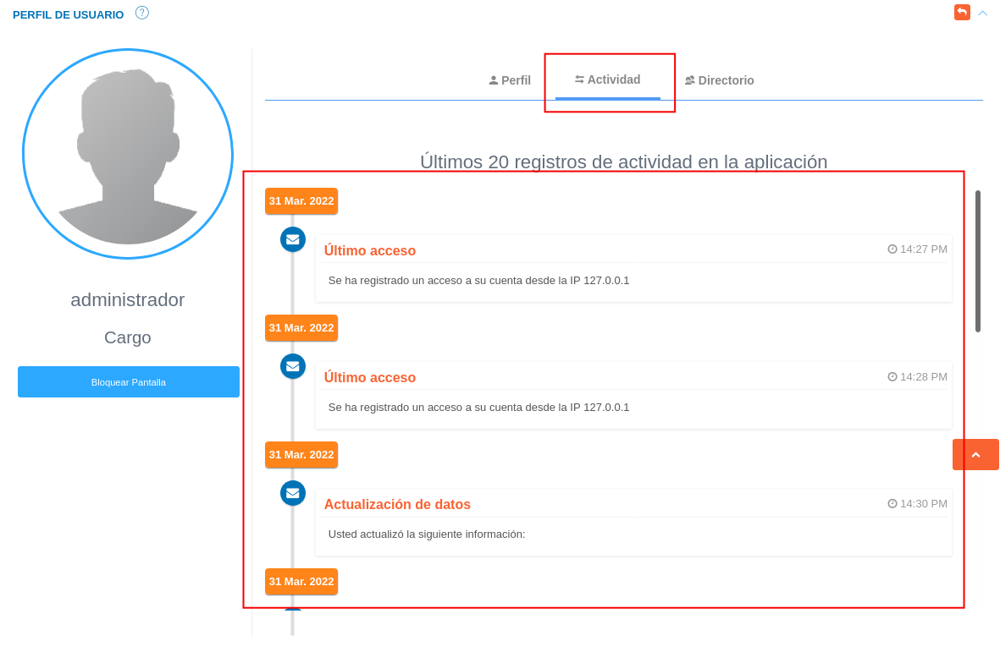

# Configuración de Cuenta de Usuario  
************************************

Una vez se ha iniciado sesión en el sistema se sugiere completar la configuración de cuenta de usuario para habilitar o deshabiltar funciones para la cuenta de usuario en gestión.

## Mi configuración y datos 

Para completar la configuración de cuenta de usuario se deben seguir los siguientes pasos: 

1)	Ingresar a la opción **Mi configuración y datos** haciendo clic sobre el **icono de usuario** ubicado en el panel superior del sistema.

!!! note ""
	**Icono de usuario**

	

Figura 17: Configuración de Cuenta de Usuario

2)	A continación se despliega un menú con las siguientes opciones: 

1.	***Configurar Cuenta.*** 

2.	***Mi Perfil.***  

3.	***Bloquear Pantalla.*** 

4.	***Ayuda.***

5.	***Salir.***
	
3)	Ingresar a la opción **Configurar Cuenta**.

### Configurar cuenta 

Figura 18: Configurar Cuenta de Usuario

Al ingresar sobre la opción **Configurar cuenta** el sistema muestra dos secciones titulas **General** y **Notificaciones**.

Figura 19: Mi Configuración

**General**

- Presione el botón **Maximizar Panel**  para desplegar la sección **General**. 

Figura 20: Mi Configuración- General

En esta sección es posible habilitar o deshabilitar la funcionalidad para **Bloqueo de Pantalla**.

Figura 21: Configuración General

- Indique la opción  del botón de selección del campo **Activar** , si desea habilitar la opción de bloqueo de pantalla. 
- Indique la cantidad de minutos de inactividad para bloquear pantalla en el campo **Tiempo de inactividad**.  
- Presione el botón **Guardar**   para registrar los cambios efectuados.
- Presione el botón **Cancelar**   para cancelar registro y regresar a la ruta anterior.
- Presione el botón **Borrar**  para eliminar datos del formulario.
- Si desea recibir ayuda guiada presione el botón .
- Para retornar a la ruta anterior presione el botón .

**Notificaciones**

- Presione el botón **Maximizar Panel**  para desplegar la sección **Notificaciones**. 

Figura 22: Mi Configuración- Notificaciones

En esta sección es posible habilitar o deshabilitar notificaciones emitidas por el sistema.

Figura 23
: Configuración de Notificaciones

- Indique la opción  del botón de selección de cada campo, si desea habilitar la opción de notificación para ese registro correspondiente. 
- Presione el botón **Guardar**   para registrar los cambios efectuados.
- Presione el botón **Cancelar**   para cancelar registro y regresar a la ruta anterior.
- Presione el botón **Borrar**  para eliminar datos del formulario.
- Si desea recibir ayuda guiada presione el botón .
- Para retornar a la ruta anterior presione el botón .

3)	Ingresar a la opción **Mi Perfil**.

### Mi perfil

Figura 24: Mi Perfil

Al ingresar sobre la opción **Mi Perfil** el sistema muestra una pantalla con tres secciones que corresponden a **Perfil**, **Actividad** y **Directorio** (ver Figura ). 

**Perfil**

A través de la sección **Perfil** es posible realizar las siguientes acciones: **Cambiar contraseña**, **Bloquear pantalla** y **Cambiar foto de perfil**.

Figura 25: Perfil

**Cambiar contraseña**

-	Para cambiar contraseña se requiere completar los campos **Nueva Contraseña** y **Confirmar Contraseña**.
- 	Presione el botón **Guardar**   para registrar los cambios efectuados.

Figura 26: Cambiar Contraseña

**Bloquear pantalla**

-	Presione el botón **Bloquear pantalla** para ejcutar el bloqueo de pantalla. 

Figura 27: Bloquear Pantalla desde Perfil de Ususario

-	Para desbloquear pantalla, ingrese la contraseña de la cuenta de usuario y presione el botón **Acceder** 

Figura 28: Pantalla de Bloqueo 
 

**Cambiar foto de perfil**

-	Para cambiar la imagen de perfil haz clic sobre la imagen de usuario (Figura ) y seleccione el archivo a cargar desde su directorio local.  
- 	Presione el botón **Guardar**   para registrar los cambios efectuados.  

Figura 29: Foto de Perfil 

**Actividad**

A través de esta sección se realiza un monitoreo sobre los últimos 20 registros de actividad en la aplicación.  

Figura 30: Actividad

**Directorio** 

A través de esta sección se listan los registros de cuentas de correos electrónicos de usuarios registrados en el sistema. 

-	Haga clic sobre una cuenta de correo electrónico seleccionada para enviar un correo electrónico a través de una aplicación cliente de correo. 

Figura 31: Directorio

3)	Seleccionar la opción **Bloquear Pantalla**.

### Bloquear pantalla 

Figura 32: Bloquear Pantalla
 

- A continuación el sistema se encuentra en bloqueo de pantalla. 

Figura 33: Pantalla de Bloqueo 
 

- Para desbloquear pantalla, ingrese la contraseña de la cuenta de usuario y presione el botón **Acceder** 

4)	Seleccionar la opción **Ayuda**.

### Ayuda

A través de esta opción el usuario tiene acceso a la documentación de usuario del sistema. 

Figura 34: Solicitar Ayuda

### Salir

A través de esta opción el usuario cierra sesión en el sistema. 

Figura 35: Salir del Sistema

