# Configuración de Acceso al Sistema  
************************************

## Roles y Permisos

A través de la sección **Roles y Permisos**, el usuario ***Administrador*** o algún otro usuario con permisos especiales sobre la **Configuración** del sistema puede realizar la asignación de permisos para los diferentes roles definidos.    

### Gestión de roles y permisos

La gestión de roles y permisos se lleva a cabo siguiendo los pasos que se describen a continuación:

***Usuario Administrador***

-   Acceder al sistema e iniciar sesión con usuario y contraseña.
-   Ingresar a través del panel lateral a **Configuración** > **Acceso** > **Roles/Permisos** (ver Figura 15).

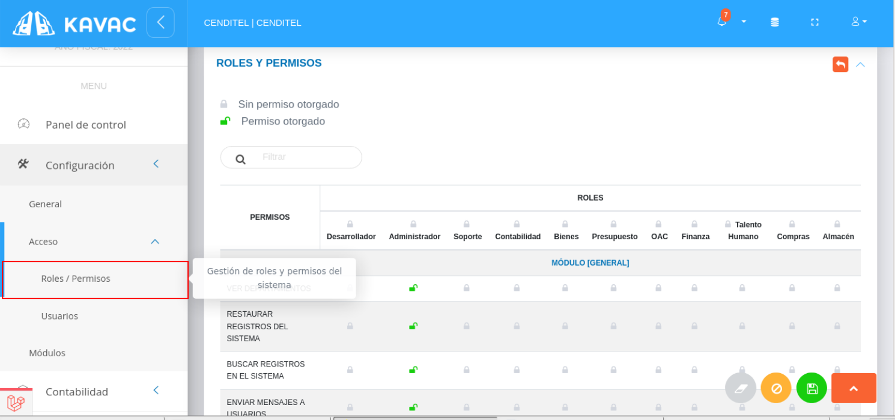
Figura 110: Roles y Permisos

-   Presione el icono **Sin permiso otorgado**  ubicado a un lado del nombre del rol de usuario, si desea cambiar el estado a **Permiso otorgado**  para **habilitar todos los permisos** para este rol de usuario (ver Figura).

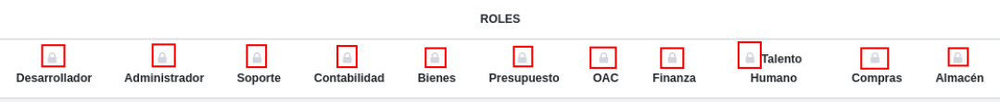
Figura 111: Habilitar todos los Permisos

-   Presione el icono **Sin permiso otorgado**  ubicado sobre una fila asociada a un permiso específico, si desea cambiar el estado a **Permiso otorgado**  para **habilitar el permiso** a este rol de usuario (ver Figura).

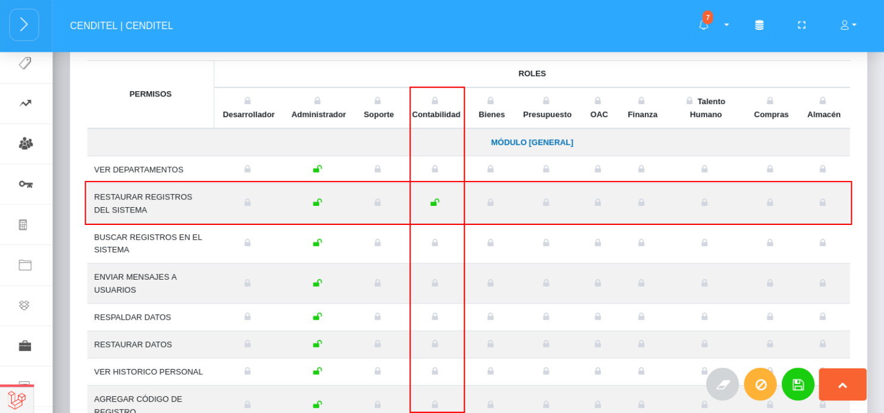
Figura 112: Habilitar Permiso

- Presione el botón **Guardar**   para registrar los cambios efectuados.
- Presione el botón **Cancelar**   para cancelar registro y regresar a la ruta anterior.
- Presione el botón **Borrar**  para eliminar datos del formulario.
- Si desea recibir ayuda  guiada, presione el botón .
- Para retornar a la ruta anterior, presione el botón .

## Usuarios

A través de la sección **Usuarios** de la **Configuración de Acceso al Sistema** se lleva a cabo la gestión de cuentas de usuarios por parte de un usuario ***Administrador*** o un usuario con permisos especiales sobre la **Configuración** del sistema. Desde esta sección es posible crear una cuenta de usuario, definir roles y permisos para la cuenta de usuario en gestión, editar, eliminar y consultar cuentas de usuarios. 

Para la gestión de cuentas de usuarios se deben seguir los siguientes pasos:
### Crear cuenta de usuario

***Usuario Administrador***

-   Acceder al sistema e iniciar sesión con usuario y contraseña.
-   Ingresar a través del panel lateral a **Configuración** > **Acceso** > **Usuarios** (ver Figura 16).
-   Presione el botón **Crear**  ubicado en la esquina superior derecha de la sección **Usuarios**. 

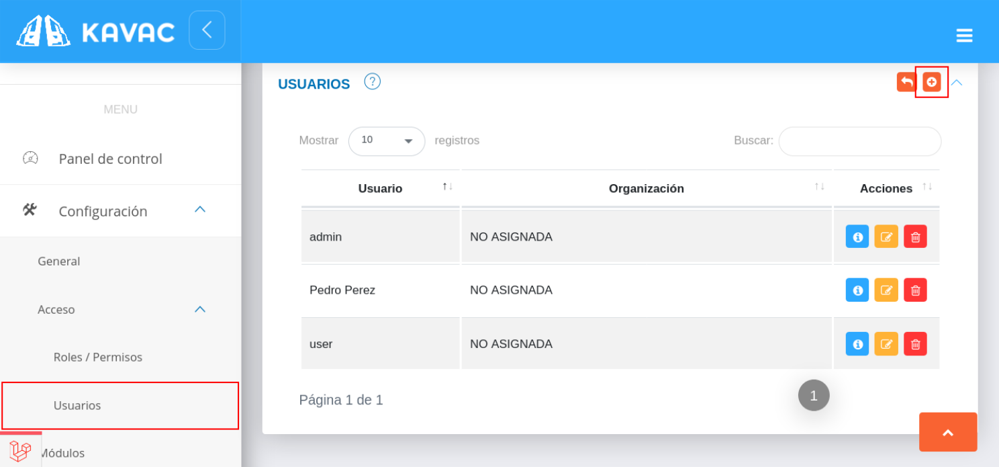
Figura 113: Usuarios

-   Complete el formulario **Gestión de Usuario**.  Seleccione un trabajador registrado en la nómina del módulo de talento humano a través del campo **Empleado**(no obligatorio), asigne un **Nombre**, **Correo electrónico** y **Usuario** para la cuenta en gestión.  

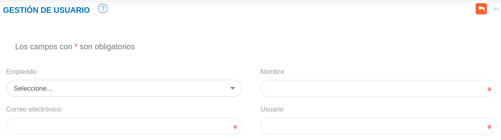
Figura 114: Gestión de Usuario

-    Indique la opción  del botón de selección para los roles que se desea habilitar para la cuenta de usuario en gestión. 

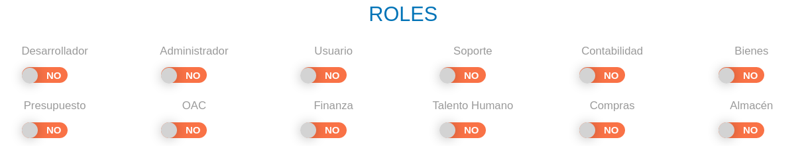
Figura 115: Roles del Usuario

-    Indique la opción  del botón de selección para los permisos que se desea habilitar para la cuenta de usuario en gestión. 

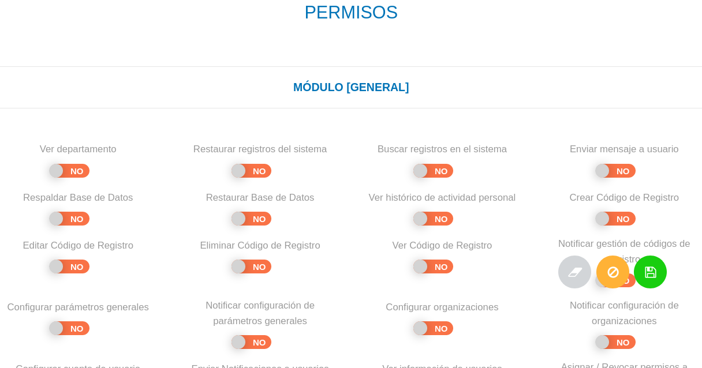
Figura 116: Permisos del Usuario

- Presione el botón **Guardar**   para registrar los cambios efectuados.
- Presione el botón **Cancelar**   para cancelar registro y regresar a la ruta anterior.
- Presione el botón **Borrar**  para eliminar datos del formulario.
- Si desea recibir ayuda  guiada, presione el botón .
- Para retornar a la ruta anterior presione el botón .

### Consultar registro de cuenta de usuario 

-   Ingresar a través del panel lateral a **Configuración** > **Acceso** > **Usuarios**.
-   Presione el botón **Consultar registro**  ubicado en la columna titulada **Acción** de un registro de usuario que se desea consultar. 

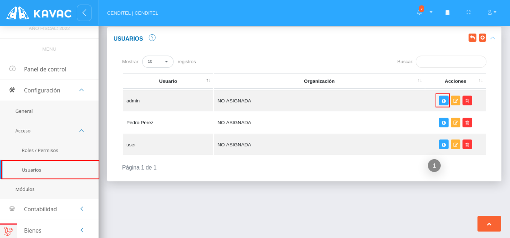
Figura 117: Usuarios

-   A continuación el sistema despliega una sección donde se describen los datos de la cuenta de usuario seleccionada.

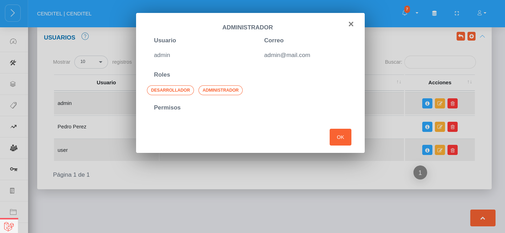
Figura 118: Consultar Cuenta de Usuario

### Editar registro de cuenta de usuario

-   Ingresar a través del panel lateral a **Configuración** > **Acceso** > **Usuarios**.
-   Presione el botón **Editar registro**  ubicado en la columna titulada **Acción** de un registro de usuario que se desea actualizar.

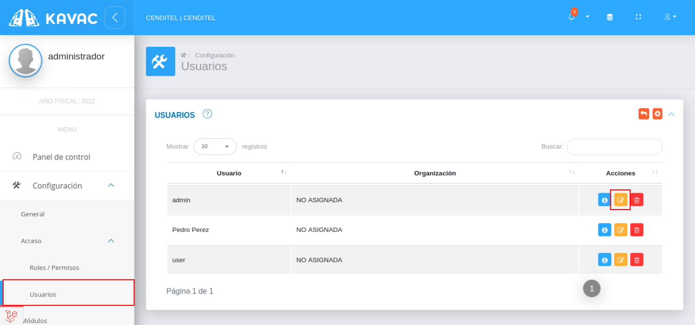
Figura 119: Editar Cuenta de Usuario

-   Actualice los datos del formulario de **Gestión de Usuario**.
-   Presione el botón **Guardar**   para registrar los cambios efectuados.
### Eliminar registro de cuenta de usuario

-   Ingresar a través del panel lateral a **Configuración** > **Acceso** > **Usuarios**.
-   Presione el botón **Eliminar registro**  ubicado en la columna titulada **Acción** de un registro de usuario que se desea eliminar.

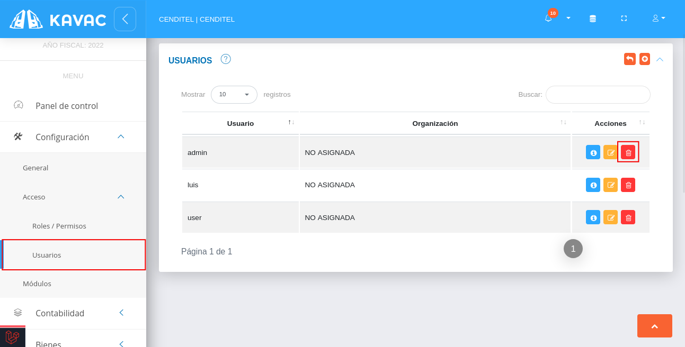
Figura 120: Eliminar Cuenta de Usuario

