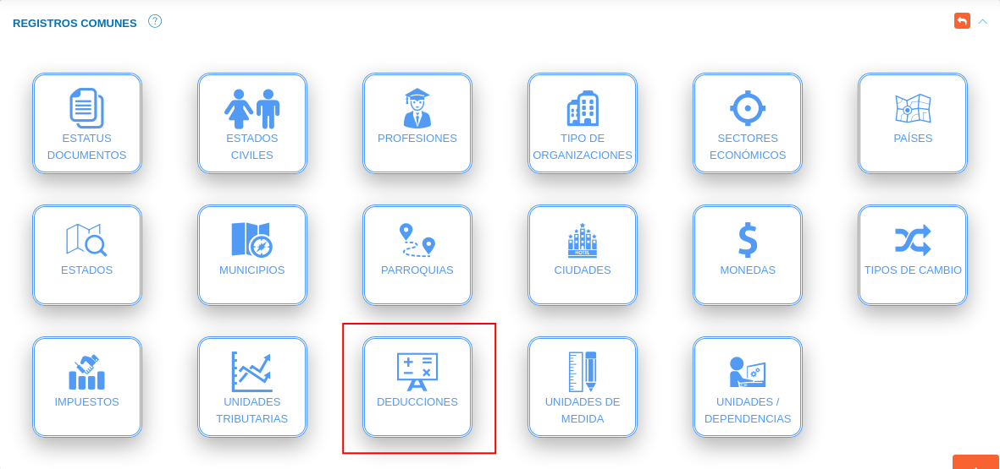

#Configuración General del Sistema  
**********************************

## Parámetros generales

A través de la sección parámetros generales, el usuario ***Administrador*** o algún otro usuario con permisos especiales sobre la **Configuración** del sistema puede habilitar o deshabilitar funcionalidades para la aplicación (Figura 10). A continuación se listan las funcionalidades a gestionar a través de la configuración de parámetros generales. 

**Funcionalidades**: 

- **Notificaciones**: Mediante esta funcionalidad, el sistema activa las notificaciones de la aplicación.

- **Banner en reportes**: Activa el uso de banner para reportes emitidos por el sistema. Para su correcto funcionamiento es necesario añadir un banner en la configuración de la organización usuaria.  

- **Multi gestión**: Mediante esta funcionalidad, el sistema activa la gestión administrativa para el empleo de múltiples organizaciones.

- **Firma electrónica**: Mediante esta funcionalidad, el sistema activa la firma electrónica para todos los procesos del sistema.
### Activar funcionalidades

Para activar funcionalidades de la aplicación se deben seguir los siguientes pasos: 

***Usuario Administrador***

-   Acceder al sistema e iniciar sesión con usuario y contraseña.
-   Ingresar a través del panel lateral a **Configuración** > **General** y ubicarse en la sección **Parámetros Generales** (ver Figura).

Figura 48: Parámetros Generales

-   Indique la opción  del botón de selección de las funcionalidades que desee habilitar. 
-   Presione el botón **Guardar**   para registrar los cambios efectuados.
-   Presione el botón **Cancelar**   para cancelar registro y regresar a la ruta anterior.
-   Presione el botón **Borrar**  para eliminar datos del formulario.
-   Si desea recibir ayuda guiada, presione el botón .
-   Para retornar a la ruta anterior, presione el botón .

## Registros comunes

La sección de registros comunes es una herramienta de la **Configuración General del Sistema** que permite al administrador o un usuario con permisos especiales sobre la **Configuración**, ajustar el sistema a la organización usuaria a través de parámetros configurables.   Los datos registrados en esta sección serán considerados en todo el sistema.

### Establecer registros comunes

Para establecer registros comunes se deben seguir los siguientes pasos: 

***Usuario Administrador***

-   Acceder al sistema e iniciar sesión con usuario y contraseña.
-   Ingresar a través del panel lateral a **Configuración** > **General** y ubicarse en la sección **Registros Comunes** (ver Figura).

Figura 49: Registros Comunes

**Estatus documentos**

-   Ingresar a la opción **Estatus documentos** dando clic sobre el recuadro. 

Figura 50: Registros Comunes Estatus Documentos

***Registro de estatus de documentos***

-   Complete el formulario **Estatus de Documento** (ver Figura).   Seleccione un color dando clic sobre el recuadro del campo **Color**, asigne un nombre y descripción para el proceso en que se encuentra el documento a través de los campos **Nombre** y **Descripción** respectivamente, seleccione una acción que ejecuta a través del botón de selección . 
-   Presione el botón  **Guardar** para registrar los cambios efectuados.
-   Presione el botón  **Cancelar** para limpiar datos del formulario.
-   Presione el botón  **Cerrar** para cerrar el formulario.

Figura: Formulario Estatus de Documento

***Gestión de registros de estatus de documentos***

-   Para editar un registro de **estatus de documento** presione el botón **Editar**  del registro seleccionado de la tabla **Registros**.  A continuación complete el formulario **Estatus De Documento** y presione el botón **Guardar** para almacenar los cambios efectuados.
-   Para eliminar un registro de **estatus de documento** presione el botón **Eliminar**  del registro seleccionado de la tabla **Registros**. 

Figura 51: Registros Estatus De Documento

**Estados civiles**

-   Ingresar a la opción **Estados civiles** dando clic sobre el recuadro. 

Figura 52: Registros Comunes Estados Civiles

***Registro de estados civiles***

-   Complete el formulario **Estados Civiles** (ver Figura). Asigne un nombre para el estado civil a registrar a través del campo **Nombre**. 
-   Presione el botón  **Guardar** para registrar los cambios efectuados.
-   Presione el botón  **Cancelar** para limpiar datos del formulario.
-   Presione el botón  **Cerrar** para cerrar el formulario.

Figura: Formulario Estados Civiles

***Gestión de registros de estados civiles***

-   Para editar un registro de **estados civiles** presione el botón **Editar**  del registro seleccionado de la tabla **Registros**.  A continuación complete el formulario **Estados Civiles** y presione el botón **Guardar** para almacenar los cambios efectuados.
-   Para eliminar un registro de **estados civiles** presione el botón **Eliminar**  del registro seleccionado de la tabla **Registros**. 

Figura 53: Registros Estados Civiles

**Profesiones**

-   Ingresar a la opción **Profesiones** dando clic sobre el recuadro. 

Figura 54: Registros Comunes Profesiones

***Registro de profesiones***

-   Complete el formulario **Profesiones** (ver Figura). Asigne un acrónimo(abreviatura) y nombre para la profesión a registrar. 
-   Presione el botón  **Guardar** para registrar los cambios efectuados.
-   Presione el botón  **Cancelar** para limpiar datos del formulario.
-   Presione el botón  **Cerrar** para cerrar el formulario.

Figura: Formulario Estados Civiles

***Gestión de registros de profesiones***

-   Para editar un registro de **profesiones** presione el botón **Editar**  del registro seleccionado de la tabla **Registros**.  A continuación complete el formulario **Profesiones** y presione el botón **Guardar** para almacenar los cambios efectuados.
-   Para eliminar un registro de **profesiones** presione el botón **Eliminar**  del registro seleccionado de la tabla **Registros**. 

Figura 55: Registros Estados Civiles

**Tipo de organización**

-   Ingresar a la opción **tipo de organización** dando clic sobre el recuadro. 

Figura 56: Registros Comunes Tipo de Organización

***Registro de tipo de organización***

-   Complete el formulario **Tipo de Organización** (ver Figura). Asigne un acrónimo(abreviatura) y nombre para el tipo de organización a registrar. 
-   Presione el botón  **Guardar** para registrar los cambios efectuados.
-   Presione el botón  **Cancelar** para limpiar datos del formulario.
-   Presione el botón  **Cerrar** para cerrar el formulario.

Figura 57: Formulario Tipo de Organización

***Gestión de registros de tipos de organizaciones***

-   Para editar un registro de **tipo de organización** presione el botón **Editar**  del registro seleccionado de la tabla **Registros**.  A continuación complete el formulario **Tipo de Organización** y presione el botón **Guardar** para almacenar los cambios efectuados.
-   Para eliminar un registro de **tipo de organización** presione el botón **Eliminar**  del registro seleccionado de la tabla **Registros**. 

Figura 58: Registros Tipo de Organización

**Sectores económicos**

-   Ingresar a la opción **Sectores Económicos** dando clic sobre el recuadro. 

Figura 59: Registros Comunes Sectores Económicos

***Registro de sector económico***

-   Complete el formulario **Sector Económico** (ver Figura). Asigne un nombre para el sector económico a registrar. 
-   Presione el botón  **Guardar** para registrar los cambios efectuados.
-   Presione el botón  **Cancelar** para limpiar datos del formulario.
-   Presione el botón  **Cerrar** para cerrar el formulario.

Figura 60: Formulario Sector Económico

***Gestión de registros de sectores económicos***

-   Para editar un registro de **sector económico** presione el botón **Editar**  del registro seleccionado de la tabla **Registros**.  A continuación complete el formulario **Sector Económico** y presione el botón **Guardar** para almacenar los cambios efectuados.
-   Para eliminar un registro de **sector económico** presione el botón **Eliminar**  del registro seleccionado de la tabla **Registros**. 

Figura 61: Registros Sector Económico

**Países**

-   Ingresar a la opción **Países** dando clic sobre el recuadro. 

Figura 62: Registros Comunes Países

***Registro de países***

-   Complete el formulario **País** (ver Figura). Asigne un acrónimo(código de área) y nombre del país a registrar.
-   Presione el botón  **Guardar** para registrar los cambios efectuados.
-   Presione el botón  **Cancelar** para limpiar datos del formulario.
-   Presione el botón  **Cerrar** para cerrar el formulario.

Figura 63: Formulario Países

***Gestión de registros de países***

-   Para editar un registro de **país** presione el botón **Editar**  del registro seleccionado de la tabla **Registros**.  A continuación complete el formulario **País** y presione el botón **Guardar** para almacenar los cambios efectuados.
-   Para eliminar un registro de **país** presione el botón **Eliminar**  del registro seleccionado de la tabla **Registros**. 

Figura 64: Registros Países

**Estados**

-   Ingresar a la opción **Estados** dando clic sobre el recuadro. 

Figura 65: Registros Comunes Estados

***Registro de estados***

-   Complete el formulario **Estados** (ver Figura).    Seleccione un país asociado, asigne un código y nombre del estado a registrar.
-   Presione el botón  **Guardar** para registrar los cambios efectuados.
-   Presione el botón  **Cancelar** para limpiar datos del formulario.
-   Presione el botón  **Cerrar** para cerrar el formulario.

Figura 66: Formulario Estados

***Gestión de registros de estados***

-   Para editar un registro de **estado** presione el botón **Editar**  del registro seleccionado de la tabla **Registros**.  A continuación complete el formulario **Estados** y presione el botón **Guardar** para almacenar los cambios efectuados.
-   Para eliminar un registro de **estado** presione el botón **Eliminar**  del registro seleccionado de la tabla **Registros**. 

Figura 67: Registros Estados

**Municipios**

-   Ingresar a la opción **Municipios** dando clic sobre el recuadro. 

Figura 68: Registros Comunes Municipios

***Registro de municipios***

-   Complete el formulario **Municipios** (ver Figura). Seleccione el país y estado asociado, asigne un código y nombre del municipio a registrar.
-   Presione el botón  **Guardar** para registrar los cambios efectuados.
-   Presione el botón  **Cancelar** para limpiar datos del formulario.
-   Presione el botón  **Cerrar** para cerrar el formulario.

Figura 69: Formulario Municipios

***Gestión de registros de municipios***

-   Para editar un registro de **municipio** presione el botón **Editar**  del registro seleccionado de la tabla **Registros**.  A continuación complete el formulario **Municipios** y presione el botón **Guardar** para almacenar los cambios efectuados.
-   Para eliminar un registro de **municipio** presione el botón **Eliminar**  del registro seleccionado de la tabla **Registros**. 

Figura 70: Registros Estados

**Parroquias**

-   Ingresar a la opción **Parroquias** dando clic sobre el recuadro.

Figura 71: Registros Comunes Parroquias

***Registro de parroquias***

-   Complete el formulario **Parroquias** (ver Figura). Seleccione el país, estado y municipio asociado, asigne un código y nombre de la parroquia a registrar.
-   Presione el botón  **Guardar** para registrar los cambios efectuados.
-   Presione el botón  **Cancelar** para limpiar datos del formulario.
-   Presione el botón  **Cerrar** para cerrar el formulario.

Figura 72: Formulario Parroquias

***Gestión de registros de parroquias***

-   Para editar un registro de **parroquia** presione el botón **Editar**  del registro seleccionado de la tabla **Registros**.  A continuación complete el formulario **Parroquias** y presione el botón **Guardar** para almacenar los cambios efectuados.
-   Para eliminar un registro de **parroquia** presione el botón **Eliminar**  del registro seleccionado de la tabla **Registros**. 

Figura 73: Registros Parroquias

**Ciudades**

-   Ingresar a la opción **Ciudades** dando clic sobre el recuadro.

Figura 74: Registros Comunes Ciudades

***Registro de ciudades***

-   Complete el formulario **Ciudades** (ver Figura). Seleccione el país y estado asociado, asigne un nombre de la ciudad a registrar.
-   Presione el botón  **Guardar** para registrar los cambios efectuados.
-   Presione el botón  **Cancelar** para limpiar datos del formulario.
-   Presione el botón  **Cerrar** para cerrar el formulario.

Figura 75: Formulario Ciudades

***Gestión de registros de ciudades***

-   Para editar un registro de **ciudad** presione el botón **Editar**  del registro seleccionado de la tabla **Registros**.  A continuación complete el formulario **Ciudades** y presione el botón **Guardar** para almacenar los cambios efectuados.
-   Para eliminar un registro de **ciudad** presione el botón **Eliminar**  del registro seleccionado de la tabla **Registros**. 

Figura 76: Registros Ciudades

**Monedas**

-   Ingresar a la opción **Monedas** dando clic sobre el recuadro.

Figura 77: Registros Comunes Monedas

***Registro de monedas***

-   Complete el formulario **Monedas** (ver Figura). Seleccione el país, asigne un símbolo, nombre y cantidad de decimales de la moneda a registrar.
-   Para configurar una moneda registrada por defecto en el sistema indique la opción  del botón de selección del campo **Por defecto**.
-   Presione el botón  **Guardar** para registrar los cambios efectuados.
-   Presione el botón  **Cancelar** para limpiar datos del formulario.
-   Presione el botón  **Cerrar** para cerrar el formulario.

Figura 78: Formulario Monedas

***Gestión de registros de monedas***

-   Para editar un registro de **moneda** presione el botón **Editar**  del registro seleccionado de la tabla **Registros**.  A continuación complete el formulario **Monedas** y presione el botón **Guardar** para almacenar los cambios efectuados.
-   Para eliminar un registro de **moneda** presione el botón **Eliminar**  del registro seleccionado de la tabla **Registros**. 

Figura 79: Registros Monedas

**Tipos de cambio**

-   Ingresar a la opción **Tipos de Cambio** dando clic sobre el recuadro.

Figura 80: Registros Comunes Tipos de Cambio

***Registro de tipo de cambio***

-   Complete el formulario **Tipos de Cambio** (ver Figura). Seleccione la moneda de origen y la moneda de cambio a través de los campos **De** y **A** respectivamente, especifique las fechas de vigencia del tipo de cambio a través de los campos **Fecha de inicio** y **Fecha fin**(no obligatorio), asigne el monto del tipo de cambio e indique si el tipo de cambio se encuentra activo haciendo uso del botón de selección .
-   Presione el botón  **Guardar** para registrar los cambios efectuados.
-   Presione el botón  **Cancelar** para limpiar datos del formulario.
-   Presione el botón  **Cerrar** para cerrar el formulario.

Figura 81: Formulario Tipo de Cambio

***Gestión de registros de tipos de cambio***

-   Para editar un registro de **tipo de cambio** presione el botón **Editar**  del registro seleccionado de la tabla **Registros**.  A continuación complete el formulario **Tipos de Cambio** y presione el botón **Guardar** para almacenar los cambios efectuados.
-   Para eliminar un registro de **tipo de cambio** presione el botón **Eliminar**  del registro seleccionado de la tabla **Registros**. 

Figura 82: Registros Tipo de Cambio

**Impuestos**

-   Ingresar a la opción **Impuestos** dando clic sobre el recuadro.

Figura 83: Registros Comunes Impuestos

***Registro de impuestos***

-   Complete el formulario **Impuestos** (ver Figura). Asigne un nombre, descripción, fecha de entrada en vigencia y valor porcentual del impuesto a registrar.
-   Indique si el impuesto afecta cuenta de iva y se encuentra activo a través del botón de selección  de los campos **Afecta cuenta de IVA** y **Activo**. 
-   Presione el botón  **Guardar** para registrar los cambios efectuados.
-   Presione el botón  **Cancelar** para limpiar datos del formulario.
-   Presione el botón  **Cerrar** para cerrar el formulario.

Figura 84: Formulario Impuestos

***Gestión de registros de impuestos***

-   Para editar un registro de **impuestos** presione el botón **Editar**  del registro seleccionado de la tabla **Registros**.  A continuación complete el formulario **Impuestos** y presione el botón **Guardar** para almacenar los cambios efectuados.
-   Para eliminar un registro de **impuesto** presione el botón **Eliminar**  del registro seleccionado de la tabla **Registros**. 

Figura 85: Registros Impuestos

**Unidades tributarias**

-   Ingresar a la opción **Unidades Tributarias** dando clic sobre el recuadro.

Figura 86: Registros Comunes Unidades Tributarias

***Registro de unidades tributarias***

-   Complete el formulario **Unidades Tributarias** (ver Figura). Indique la fecha de vigencia a través de los campos **Fecha de inicio** y **Fecha fin**, Asigne un valor de la unidad tributaria e indique a través del botón de selección si se encuentra activa. 
-   Presione el botón  **Guardar** para registrar los cambios efectuados.
-   Presione el botón  **Cancelar** para limpiar datos del formulario.
-   Presione el botón  **Cerrar** para cerrar el formulario.

Figura 87: Formulario Unidades Tributarias

***Gestión de registros de unidades tributarias***

-   Para editar un registro de **impuestos** presione el botón **Editar**  del registro seleccionado de la tabla **Registros**.  A continuación complete el formulario **Impuestos** y presione el botón **Guardar** para almacenar los cambios efectuados.
-   Para eliminar un registro de **impuesto** presione el botón **Eliminar**  del registro seleccionado de la tabla **Registros**. 

Figura 88: Registros Unidades Tributarias

**Deducciones**

-   Ingresar a la opción **Deducciones** dando clic sobre el recuadro.

Figura 89: Registros Comunes Deducciones

***Registro de deducciones***

-   Complete el formulario **Deducciones** (ver Figura). Asigne un nombre para el tipo de deducción, seleccione una cuenta contable(no obligatorio), agregue una descripción, establezca una formula asociada al tipo de deducción haciendo uso de la calculadora e indique si el tipo de deducción se encuentra activa a través del botón de selección  del campo **Activa**.
-   Presione el botón  **Guardar** para registrar los cambios efectuados.
-   Presione el botón  **Cancelar** para limpiar datos del formulario.
-   Presione el botón  **Cerrar** para cerrar el formulario.

!!! note "Nota"
    A través de esta funcionalidad se registran beneficios fiscales o deducciones enmarcados en la normativa jurídica del país en cuestión y los reglamentos de la organización.  Esta funcionalidad esta vinculada directamante con el módulo de finanzas.

    **Uso de la calculadora**:

    -   Presione el botón **C** para reiniciar valores de la formula.
    -   Presione el botón **DEDUCIBLE** para agregar la base deducible a la formula. 

Figura 90: Formulario Deducciones

***Gestión de registros de deducciones***

-   Para editar un registro de **deducción** presione el botón **Editar**  del registro seleccionado de la tabla **Registros**.  A continuación complete el formulario **Deducciones** y presione el botón **Guardar** para almacenar los cambios efectuados.
-   Para eliminar un registro de **deducción** presione el botón **Eliminar**  del registro seleccionado de la tabla **Registros**. 

Figura 91: Registros Deducción

**Unidades de medida**

-   Ingresar a la opción **unidades de medida** dando clic sobre el recuadro.

Figura 92: Registros Comunes Unidades de Medida

***Registro de unidades de medida***

-   Complete el formulario **Unidades de Medida** (ver Figura). Asigne un acrónimo(abreviatura), nombre y descripción de la unidad de medida a registrar.   
-   Presione el botón  **Guardar** para registrar los cambios efectuados.
-   Presione el botón  **Cancelar** para limpiar datos del formulario.
-   Presione el botón  **Cerrar** para cerrar el formulario.

Figura 93: Formulario Unidades de Medida

***Gestión de registros de unidades de medida***

-   Para editar un registro de **unidad de medida** presione el botón **Editar**  del registro seleccionado de la tabla **Registros**.  A continuación complete el formulario **Unidades de Medida** y presione el botón **Guardar** para almacenar los cambios efectuados.
-   Para eliminar un registro de **unidad de medida** presione el botón **Eliminar**  del registro seleccionado de la tabla **Registros**. 

Figura 94: Registros Unidades de Medida

**Unidades/Dependencias**

-   Ingresar a la opción **Unidades/Dependencias** dando clic sobre el recuadro. 

Figura 95: Registros Comunes Unidades de Medida

***Registro de unidad/dependencia***

-   Complete el formulario **Unidades/Dependencias** (ver Figura). Seleccione una organización a la cual se encuentra asociado el departamento(unidad/dependencia), en caso de que dependa o se encuentre asociado a otro departamento seleccione este departamento a través del campo **Depende de**, asigne una abreviatura a través del campo **Siglas** y defina un nombre para el departamento a registrar. 
-   Indique la opción  del botón de selección de los siguientes campos:
    -   **Solicita almacén**: requiere registro de almacén. 
    -   **Activo**: registro de departamento como activo.
    -   **Administrativo**: departamento del área administrativa de la organización.
-   Presione el botón  **Guardar** para registrar los cambios efectuados.
-   Presione el botón  **Cancelar** para limpiar datos del formulario.
-   Presione el botón  **Cerrar** para cerrar el formulario.

Figura 96: Formulario Unidad/Dependencia

***Gestión de registros de unidades/dependencias***

-   Para editar un registro de **país** presione el botón **Editar**  del registro seleccionado de la tabla **Registros**.  A continuación complete el formulario **País** y presione el botón **Guardar** para almacenar los cambios efectuados.
-   Para eliminar un registro de **país** presione el botón **Eliminar**  del registro seleccionado de la tabla **Registros**. 

Figura 97: Registros Unidad/Dependencia

## Configurar organización

Para iniciar el registro de una organización se deben seguir los siguientes pasos: 

***Usuario Administrador***

-   Acceder al sistema e iniciar sesión con usuario y contraseña.
-   Ingresar a través del panel lateral a **Configuración** > **General** y ubicarse en la sección **Configurar Organización** (ver Figura).

Figura 98: Configurar Organización

### Logotipo y banner institucional

-   Para establecer un logotipo y banner institucional haga clic sobre los recuadros correspondientes que tienen por titulo **IMAGEN** (ver Figura).
-   Seleccione un archivo desde su directorio local (ver Figura ).  

Figura 99: Seleccionar Logotipo y Banner Institucional desde Directorio Local
 

Figura 100: Logotipo y Banner Institucional

### Datos básicos

-   Complete el formulario del apartado **Datos Básicos**. Tenga en consideración completar los campos obligatorios que son requeridos para el registro de una institución.

!!! note "Nota"
    Los campos de selección del apartado **Datos básicos** incluyen información configurada previamente a través de los registros comunes del sistema. Si se requiere incluir información diferente a la que se encuentra por defecto se recomienda agregar estos registros en la configuración de registros comunes. 

    Para agregar registros comunes acceda a **Configuración** > **General** > **Registros Comunes**. 

    

    -   ***País***: Para crear un nuevo registro de país acceda a **Configuración** > **General** > **Registros Comunes** > **Países**. 
    -   ***Estado***: Para crear un nuevo registro de estado acceda a **Configuración** > **General** > **Registros Comunes** > **Estados**. 
    -   ***Municipio***: Para crear un nuevo registro de municipio acceda a **Configuración** > **General** > **Registros Comunes** > **Municipios**. 
    -   ***Ciudad***: Para crear un nuevo registro de ciudad acceda a **Configuración** > **General** > **Registros Comunes** > **Ciudades**.
    -   ***Adscrito a***: Para crear un nuevo registro de dependencia acceda a **Configuración** > **General** > **Registros Comunes** > **Unidades/ Dependencias**. 
    -   ***Sector***: Para crear un nuevo registro de sector económico acceda a **Configuración** > **General** > **Registros Comunes** > **Sectores Económicos**.
    -   ***Tipo***: Para crear un nuevo registro de tipo de organización acceda a **Configuración** > **General** > **Registros Comunes** > **Tipos de organizaciones**.
     

Figura 101: Datos Básicos de la Organización

### Datos complementarios

-   Complete el formulario del apartado **Datos Complementarios**. Tenga en cuenta que todos los campos de este apartado no son obligatorios, por lo que no se requiere agregar información de forma obligatorio para completar el registro de una organización.

Figura 102: Datos Complementarios de la Organización

- Presione el botón **Guardar**   para registrar los cambios efectuados.
- Presione el botón **Cancelar**   para cancelar registro y regresar a la ruta anterior.
- Presione el botón **Borrar**  para eliminar datos del formulario.
- Si desea recibir ayuda guiada presione el botón .
- Para retornar a la ruta anterior presione el botón .

## Editar organización 

!!! note "Nota"
    Los pasos que se describen a continuación para la actualización de datos de una organización son válidos solo cuando existe el registro de una sola organización y la opción **multi gestión** del sistema se encuentra desactivada. 

    Para más información consule el apartado [Multi gestion](#multi-gestion) de este manual.

Para actualizar los datos de una organización registrada se requiere seguir lo siguientes pasos:

-   Ingresar a través del panel lateral a **Configuración** > **General** y ubicarse en la sección **Configurar Organización** (ver Figura).

Figura 103: Editar Organización

-   Actualice los datos del formulario siguiendo los pasos descritos en el apartado [Registrar organizacion](#logotipo-y-banner-institucional).
-   Presione el botón **Guardar**   para registrar los cambios efectuados.

## Multi gestión

El sistema KAVAC incorpora la gestión de multiples organizaciones desde una misma instancia.  Esta funcionalidad permite la integración entre organizaciones, abriendo paso a la gestión y control sobre recursos organizacionales y automatizando las transacciones entre dos o más organizaciones. 

Esta funcionalidad se encuentra desactivada por defecto, para activar dicha funcionalidad se requiere seguir los siguientes pasos: 

-   Ingresar a través del panel lateral a **Configuración** > **General** y ubicarse en la sección **Parámetros Generales** (ver Figura).

Figura 104: Habilitar Opción Multi-Gestión

-   Indique la opción  del botón de selección del campo **Multi gestión** para habilitar la gestión de multiples organizaciones. 
- Presione el botón **Guardar**   para registrar los cambios efectuados.
- Presione el botón **Cancelar**   para cancelar registro y regresar a la ruta anterior.
- Presione el botón **Borrar**  para eliminar datos del formulario.
- Si desea recibir ayuda guiada presione el botón .
- Para retornar a la ruta anterior presione el botón .

## Gestionar organizaciones

La gestión de organizaciones se lleva a cabo a través del apartado **Organizaciones Registradas**, este apartado se encuentra disponible si la opción [Multi gestión](#multi-gestion) se encuentra activa.  

-   Para acceder a esta sección debe dirigirse a **Configuración** > **General** y ubicarse en la sección **Registrar Organización** apartado **Organizaciones Registradas** (ver Figura).

A través del apartado **Organizaciones Registradas** se listan los registros de **Organizaciones** en una tabla.   

Desde este apartado se pueden llevar a cabo las siguientes acciones: 

-   ***Registrar organizaciones***.   
-   ***Consular registros***.
-   ***Editar registros***. 

Figura 105: Organizaciones Registradas

### Registrar organización

-   Presione el botón **Crear registro**  ubicado en la parte superior derecha del apartado **Organizaciones Registradas** (ver Figura )

Figura 106: Registrar Organización / Multi-Gestión Activa

-   A continuación complete el formulario siguiendo los pasos descritos en el apartado [Configurar organización](#logotipo-y-banner-institucional).
-   Presione el botón **Guardar**   para registrar los cambios efectuados.

### Consular registros

-   Presione el botón **Consultar registro**  ubicado en la columna titulada **Acción** de un registro de organización que se prefiere consultar. 

Figura 107: Consular Registros de Organizaciones / Multi-Gestión Activa

-   A continuación el sistema despliega una sección donde se describen los datos de la organización seleccionada. 

Figura 108: Datos de la Organización

### Editar registros

-   Presione el botón **Editar registro**   ubicado en la columna titulada **Acción** del registro de organización que se desee seleccionar para actualizar datos. 

Figura 109: Editar Registros de Organizaciones/ Multi-Gestión Activa

-   Actualice los datos del formulario siguiendo los pasos descritos en el apartado [Configurar organización](#logotipo-y-banner-institucional).
-   Presione el botón **Guardar**   para registrar los cambios efectuados.